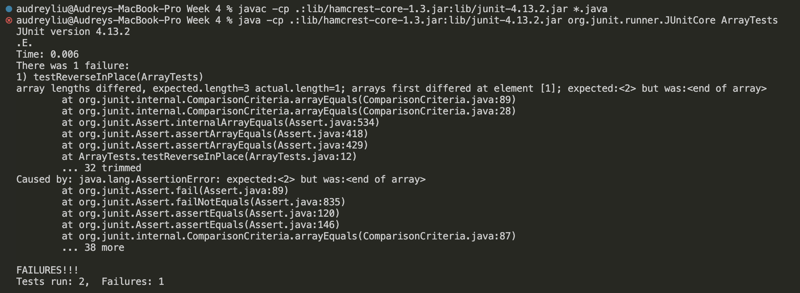
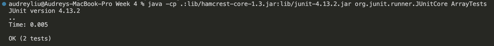

# Lab Report 3

## Part 1 - Bugs

1. A failure-inducing input for the buggy program
```
@Test
public void testReverseInPlace() {
  int[] input2 = {1, 2, 3};
  ArrayExamples.reverseInPlace(input2);
  assertArrayEquals(new int[]{3, 2, 1}, input2);
}
```

2. An input that doesn't induce a failure
```
@Test 
public void testReverseInPlace() {
  int[] input1 = { 3 };
  ArrayExamples.reverseInPlace(input1);
  assertArrayEquals(new int[]{ 3 }, input1);
}
```

3.The symptom, as the output of running the two tests above
* Test Fail Screenshot:

  

* Test Pass Screenshot:

  

4. The bug, as the before-and-after code change required to fix it
* Before
```
static void reverseInPlace(int[] arr){
  for(int i = 0; i < arr.length; i += 1){
    arr[i] = arr[arr.length - i - 1];
  }
}
```
* After
```
static void reverseInPlace(int[] arr) {
    int[] newArray = new int[arr.length];
    for(int i = 0; i < arr.length; i += 1) {
      newArray[i] = arr[arr.length - i - 1];
    }
    for(int i = 0; i < arr.length; i += 1) {
      arr[i] = newArray[i];
    }
}
```
5. Briefly describe (2-3 sentences) why the fix addresses the issue.
The issue with the original code is that when the array is reversed, the rest of the old array will also be changed. So I created a new array, and used this to save the changed array, once all changed, pass all the elements of this array to the old array.
   
## Part 2 - Researching Commands
* `-c`: This prints only a count of the lines that match a pattern.
* Citation: https://www.geeksforgeeks.org/grep-command-in-unixlinux/
```
audreyliu@Audreys-MacBook-Pro technical % grep -c -r "search" | head -n 5
./government/About_LSC/LegalServCorp_v_VelazquezSyllabus.txt:0
./government/About_LSC/Progress_report.txt:4
./government/About_LSC/Strategic_report.txt:5
./government/About_LSC/Comments_on_semiannual.txt:0
./government/About_LSC/Special_report_to_congress.txt:1
```
> When I run the '-c' command, it counts the occurrences of the word "search" in files under the Technical directory and its subdirectories and then displays the first 5 lines of output.
     
```
audreyliu@Audreys-MacBook-Pro technical % grep -c -r "search" | sort -n | head -n 5 
./911report/chapter-1.txt:11
./911report/chapter-10.txt:2
./911report/chapter-11.txt:2
./911report/chapter-12.txt:4
./911report/chapter-13.1.txt:3
```
> Running this command searches for the occurrences of the word "search" in files under the directory technical and its subdirectories. After counting the occurrences of each match, it sorts the results in numerical order and then shows the first 5 lines of the sorted output.
>
> This command is very useful because it can quickly find out where a specific keyword or phrase occurs in multiple files in a directory, and it can also count the number of occurrences of the keyword in each file.

* `-l`: Displays list of filenames only.
* Citation: https://www.geeksforgeeks.org/grep-command-in-unixlinux/
```
audreyliu@Audreys-MacBook-Pro technical % grep -l -r "search" | head -n 5
./government/About_LSC/Progress_report.txt
./government/About_LSC/Strategic_report.txt
./government/About_LSC/Special_report_to_congress.txt
./government/About_LSC/CONFIG_STANDARDS.txt
./government/About_LSC/commission_report.txt
```
> It searches for files that contain "search" under the technical directory and its subdirectories then displays the names of the first 5 files found. 
```
audreyliu@Audreys-MacBook-Pro technical % grep -l -r "search" | tail -n 5 
./911report/chapter-8.txt
./911report/preface.txt
./911report/chapter-12.txt
./911report/chapter-10.txt
./911report/chapter-11.txt
```
>It searches for files that contain "search" under the technical directory and its subdirectories then displays the names of the last 5 files found.
>
> It is useful since it helps quickly identify files containing the specific keyword within their content under the current directory and its subdirectories, then display their name only without making the ternimal more complicated.

* `-n`: Display the matched lines and their line numbers.
* Citation: https://www.geeksforgeeks.org/grep-command-in-unixlinux/
```
audreyliu@Audreys-MacBook-Pro technical % grep -n -r "search" | head -n 5
./government/About_LSC/Progress_report.txt:166:legal research and information gathering, improved supervision and
./government/About_LSC/Progress_report.txt:721:provide training on legal research for poverty law practice to
./government/About_LSC/Progress_report.txt:723:write and distribute a desktop research manual on poverty law.
./government/About_LSC/Progress_report.txt:1009:research, community legal education materials and other supportive
./government/About_LSC/Strategic_report.txt:382:their programs. Program staff research, (explained below in
```
> This command searches for the specific keyword "search" under the directory technical and its subdirectories, by the same time, it shows the first 5 matching lines and the corresponding line numbers.
```
audreyliu@Audreys-MacBook-Pro technical % grep -n -r "search" | tail -n 5
./911report/chapter-12.txt:1308:                consequences of selection now including personal searches of the individual and
./911report/chapter-10.txt:19:                officer, quickly researched the options and, sometime around 10:20, identified
./911report/chapter-10.txt:373:                received offers of general aid, search-and-rescue equipment and personnel, and
./911report/chapter-11.txt:560:                to fix glaring vulnerabilities-expanding no-fly lists, searching passengers
./911report/chapter-11.txt:593:                NSA did not think its job was to research these identities. It saw itself as an
```
> This command searches for the specific keyword "search" under the directory technical and its subdirectories, by the same time, it shows the last 5 matching lines and the corresponding line numbers.
>
> This is useful since it can quickly identify where the specific keyword appears in which files and/or in what content.

* `-h`: Display the matched lines, but do not display the filenames.
* Citation: https://www.geeksforgeeks.org/grep-command-in-unixlinux/
```
audreyliu@Audreys-MacBook-Pro technical % grep -h -r "search" | head -n 5
legal research and information gathering, improved supervision and
provide training on legal research for poverty law practice to
write and distribute a desktop research manual on poverty law.
research, community legal education materials and other supportive
their programs. Program staff research, (explained below in
```
> This command searches for the string "search" within files in the technical directory and its subdirectories, and it displays the first 5 lines of the file which contains "search" without displaying the filename. 
```
audreyliu@Audreys-MacBook-Pro technical % grep -h -r "search" | tail -n 5 
                consequences of selection now including personal searches of the individual and
                officer, quickly researched the options and, sometime around 10:20, identified
                received offers of general aid, search-and-rescue equipment and personnel, and
                to fix glaring vulnerabilities-expanding no-fly lists, searching passengers
                NSA did not think its job was to research these identities. It saw itself as an
```
> This command searches for the string "search" within files in the technical directory and its subdirectories, and it displays the last 5 lines of the file which contains "search" without displaying the filename.
>
> It is useful when we want to check the occurrences of a specific keyword in multiple files.


